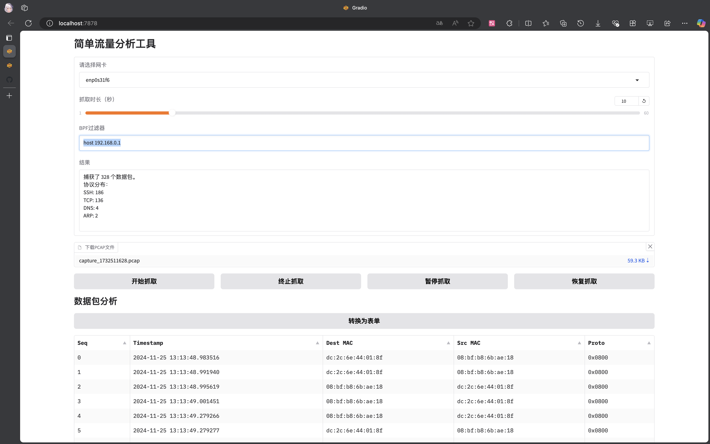
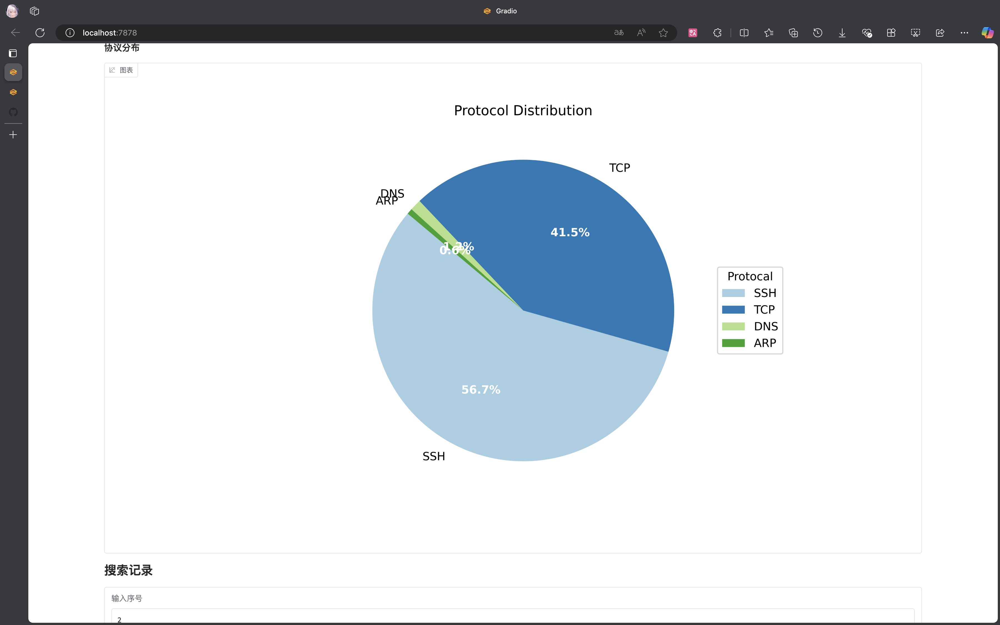
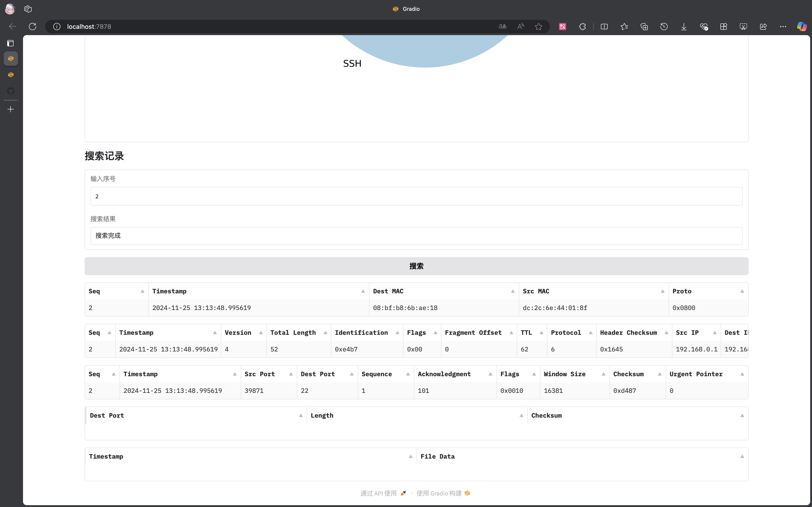

# Simple Traffic Analzyer

一个简单的流量分析工具，用于分析指定时间段内的流量数据。
基于 Python 实现一个类似 Wireshark 的简易网络协议解析器，能够支持 HTTP、TCP、UDP、IP、Ethernet 等协议数据包的首部字段逐层读取。
采用 gradio 作为前端，可以让用户指定网卡，启动抓取并分析流量数据。

纯为了校内课程网络协议分析大作业而写，不具备实际使用价值。

界面尚佳

